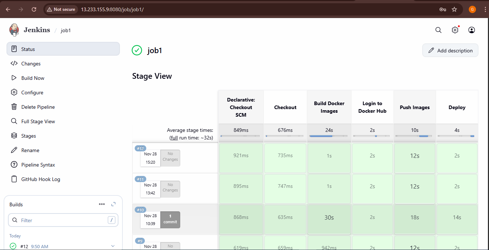
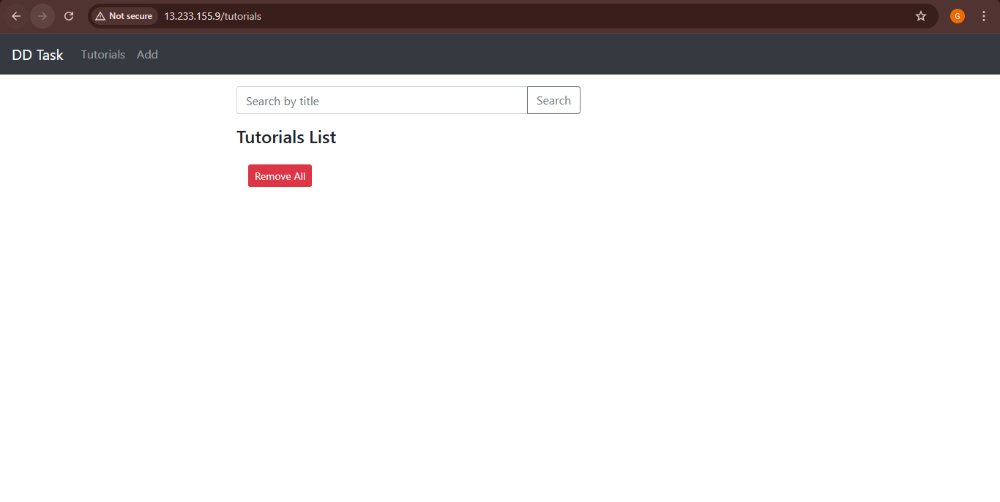
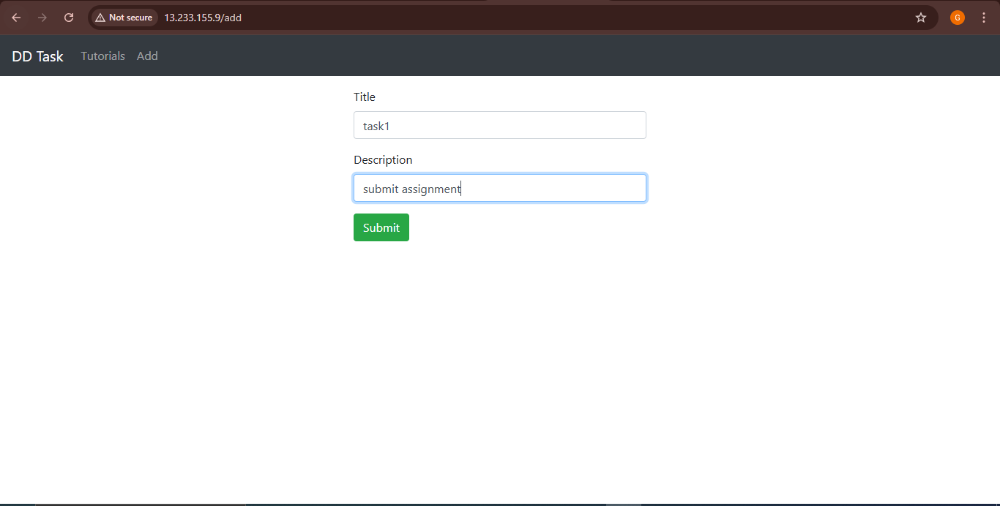
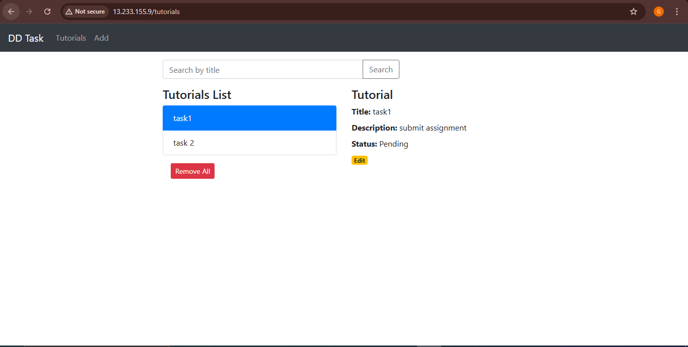

🌐 MEAN Stack Application CI/CD Deployment Guide
This document provides a formal, step-by-step procedure for deploying the MEAN (MongoDB, Express, Angular, Node.js) stack application contained within this repository to an AWS EC2 instance using an automated Jenkins CI/CD Pipeline, Docker, and Docker Compose.

🚀 1. Project Overview and Technology Stack
This application is a full-stack web service designed for CRUD operations. It is containerized to ensure consistency across development and production environments.

Git / GitHub---->Code repository and version management.
Docker--->Packaging the Angular (with NGINX), Express, and MongoDB services.
Docker Compose------>Defining and running the multi-container application stack.
Jenkins-------->Automation server for building, testing, and deploying the application.
AWS EC2-------->Cloud virtual server hosting the Jenkins server and the deployed application.
Docker Hub------->Remote repository for storing built Docker images.
________________________________________
🛠️ 2. Prerequisites and Code Preparation
Before initiating the deployment process, ensure all infrastructure and code modifications are complete.

2.1 Code Adjustments for Docker
The following files must be present and correctly configured within the repository for container networking:
1.	Database Connection: The backend service must reference the MongoDB container via its service name.
	File: backend/app/config/db.config.js
	Modification: Database URL must use the service name: mongodb://mongo:27017/dd_db.

2.	API Gateway: The frontend NGINX configuration must proxy API calls to the backend service.
    File: frontend/nginx.conf
	Modification: Include a location /api/ block with proxy_pass http://backend:8080;.

2.2 Docker Compose Configuration
The docker-compose.yml file must explicitly define the image names to prevent naming conflicts within the Jenkins environment and set host port mappings clearly.

•	Host Port Mapping: To avoid conflict with Jenkins (which defaults to port 8080), the backend service port is mapped to 8081 on the host.
YAML
version: '3.8'
services:
  mongo:
    image: mongo:latest
  backend:
    build: ./backend
    image: rmganesha/mean-backend:latest # <--- Customize this
    ports:
      - "8081:8080" # Maps host port 8081 to container port 8080
  frontend:
    build: ./frontend
    image: rmganesha/mean-frontend:latest # <--- Customize this
    ports:
      - "80:80"
depends_on:
      - backend
volumes:
  mongo_data:

2.3 Backend Dockerfile (backend/Dockerfile)
The backend uses a standard Node.js image to build and run the Express API.

Dockerfile
Stage 1: Use the official Node.js image as the base
FROM node:14

Set the working directory inside the container
WORKDIR /usr/src/app

Copy package files (package.json and package-lock.json) first
COPY package*.json ./

Install dependencies
RUN npm install

Copy the rest of the application source code
COPY . .

Expose the port the Express server is listening on
EXPOSE 8080

Define the command to run the application
CMD ["node", "server.js"]
________________________________________
2.4 Frontend Dockerfile (frontend/Dockerfile)
The frontend uses a multi-stage build for efficiency. This approach keeps the final running image small by separating the large Angular build environment (Node.js) from the lightweight serving environment (NGINX).

Dockerfile
# Stage 1: Build the Angular Application ---
FROM node:18 as build

# Set the working directory
WORKDIR /app

# Copy package files and install dependencies
COPY package*.json ./
RUN npm install

# Copy all Angular source files
COPY . .

# Run the production build command
# The output will be placed in the /app/dist/<project-name> directory
RUN npm run build  #configuration production

# Stage 2: Serve the Application with NGINX ---
FROM nginx:alpine

# Copy the built Angular files from the 'build' stage into the NGINX HTML directory
COPY --from=build /app/dist/angular-15-crud /usr/share/nginx/html

# Copy the custom NGINX configuration file. 
COPY nginx.conf /etc/nginx/conf.d/default.conf

# Expose the standard HTTP port 
EXPOSE 80
    
________________________________________
☁️ 3. AWS EC2 and Tool Setup
The Jenkins CI/CD pipeline requires the following infrastructure setup on the AWS EC2 instance.

3.1 Provision EC2 Instance
1.	Launch: Provision a new EC2 instance (e.g., Ubuntu t2.medium or larger).

2.	Security Group: Configure the security group to allow inbound traffic on:
	Port 22: SSH access.
	Port 80: HTTP access for the final application (Frontend).
	Port 8080: HTTP access for the Jenkins UI.

3.	SSH Access: Connect to the instance using the designated Key Pair.

3.2 Install Docker and Jenkins
Execute the following commands on the EC2 host to install the necessary tools:

1.	Install Docker and Compose:
Bash
sudo apt update
sudo apt install -y docker.io docker-compose
sudo usermod -aG docker $USER 

2.	Install Jenkins:
Bash
# Install Java and Jenkins (using standard repository setup)
sudo apt install -y openjdk-17-jdk
# other Jenkins installation steps on https://www.jenkins.io/doc/book/installing/linux/#debianubuntu
sudo systemctl start Jenkins #to start the Jenkins server on port 8080
sudo systemctl status Jenkins #to check the status

# Grant Jenkins user access to run Docker commands
sudo usermod -aG docker jenkins
sudo systemctl restart Jenkins #restart the Jenkins to apply the changes
________________________________________
⚙️ 4. Jenkins CI/CD Pipeline Configuration
The Jenkins server orchestrates the entire deployment process.

4.1 Jenkins Server Setup
1.	Access: Unlock and set up Jenkins by navigating to http://<EC2-PUBLIC-IP>:8080.

2.	Plugins: Install necessary plugins, along with  "Docker Pipeline".

3.	Credentials: Navigate to Manage Jenkins > Credentials > System > Global credentials and add the following:
	GitHub Credentials: (Type: Username with password/token) for repository checkout (ID: github-creds, username:github username, password:public acess token generated in the settings > developer settings> personal access token (classic)).
	Docker Hub Credentials: (Type: Username with password) for pushing images to the registry (ID: dockerhub-creds, username:dockerhub_username, password: dockerhub_password).
	
4.2 The Jenkinsfile
The Jenkinsfile at the root of the repository defines the deployment stages.
Groovy
// Jenkinsfile
pipeline {
    agent any
    environment {
        // Replace 'dockerhub-creds' with your actual credential ID
        DOCKERHUB_CREDENTIALS = credentials('dockerhub-creds') 
        
        // Ensure these match the image names in docker-compose.yml
        DOCKER_REPO = 'rmganesha' // <--- Customize this
        IMAGE_FRONTEND = "${DOCKER_REPO}/mean-frontend:latest"
        IMAGE_BACKEND = "${DOCKER_REPO}/mean-backend:latest"
    }
    stages {
        stage('Checkout Code') {
            steps {
                // Replace with your actual repository URL
                git branch: 'main', url: 'https://github.com/Ganesha2003/mean-crud-app.git' // <--- Customize this
            }
        }
        stage('Build & Tag Images') {
            steps {
                script {
                    // This command builds the images and names them according to the 'image:' tags in docker-compose.yml
                    sh 'docker-compose build' 
                }
            }
        }
        stage('Login & Push to Docker Hub') {
            steps {
                sh 'echo $DOCKERHUB_CREDENTIALS_PSW | docker login -u $DOCKERHUB_CREDENTIALS_USR --password-stdin'
                sh 'docker push $IMAGE_FRONTEND'
                sh 'docker push $IMAGE_BACKEND'
            }
        }
        stage('Deployment') {
            steps {
                // Ensure no previous containers are running
                sh 'docker-compose down' 
                
                // Pulls and starts the latest images
                sh 'docker-compose up -d' 
            }
        }
    }
}

4.3 Create the Pipeline Job
1.	Create New Item: Select Pipeline as the project type.

2.	SCM Configuration:
	Definition: Select Pipeline script from SCM.
	SCM: Select Git.
	Repository URL: Enter your GitHub Repository URL.
	Credentials: Select the configured GitHub credentials (if the repo is private).
	Script Path: Ensure this is set to Jenkinsfile.
	Trigger : GitHub webhook trigger(settingswebhookpayload url with extension as /github-webhook/jsonCreate)
________________________________________
✅ 5. Execution and Verification
5.1 Run the Deployment
Initiate the automated deployment by clicking "Build Now" in the Jenkins job view.
5.2 Access the Application
Once the Jenkins build successfully completes, the application is live and accessible via the EC2 Public IP:
•	Frontend Application: http://<EC2-PUBLIC-IP> (Port 80)

Build sucess

Application before entering data

Adding data in the application

After adding the data into the appliaction
 

